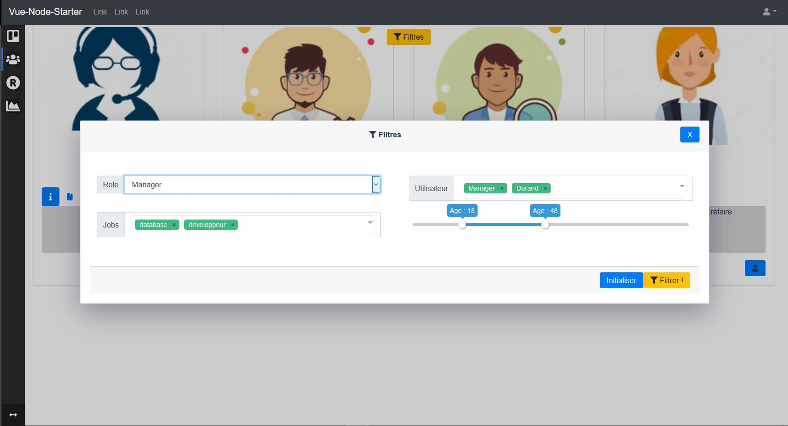

# MY FULL STACK STARTER APP ! : Vue.2.0 + Node Express mongoDb back End + CLI v4.0 + Mocha unit components testing + Shaman Linear regression lib 

Currently in DEV state !
Please allow from 1 month to 3 months for it to get finished. t<br>

<b>LATEST STARTER NEWS ! </b>
  <br>
  08-04-2020 : I'm currently focused on performance issues ( initial loading is too slow)<br>
 08-04-2020 : This app is now automatically synced to heroku, when commiting, its so easy to use !<br>
 08-04-2020 : Pictures are now stored on cloudinary, i'm trying to use the lazy loading module<br>
 08-04-2020 : I'm on  files uploading code refactoring , untill its finished, uploading wont work.<br>
 08-03-2020 : I will add 3 ways of uploading pics and files : By ftp, on cloudinary, and on the node local server, and also do a global code standardisation 
I've been so busy, and Have had to stop for 6 months but I'm back on it !!<br>
  08-03-2020 : I will finally publish the whole code including my 'secret' permissions builder directory.
 

Desc : This starter aims is to be able to start any web-app, with all ready generics components, the starter is plugged to a node.js + mongoDb Atlas back end . <br />

DEMO : HEROKU : https://vuestartergit.herokuapp.com/  (Commits are automatically synced !=)<br>
DEMO (Openode) : http://vuestarter.openode.io/<br /><br />
and can be set on heroku (https://vuestartergit.herokuapp.com/  azure and google cloud<br /><br />
Testing: log in with -> login: admin@admin.com -> password: admin <br />



<b>Won't contains :</b><br />
VUEX : It is another starter in another GIT depot of mine<br />

<b>Will Contains :</b><br />

1 Users CRUD<br />
1 Auth system<br />
1 Profiles and Permissions management system (Front and Back)<br />
1 Files management - and permissions -system by users<br />
1 Dashboard with some graphicals libs<br />
1 Form validator : (https://vuelidate.js.org/#getting-started)<br />
1 Internal Messaging CRUD<br />
1 Internal Alerts CRUD<br />
1 Node.js Emailing system<br />
1 Anti Flooding by IP System<br />
1 File session store<br />
1 Calendar lib<br />
1 V-dialog lib<br />
1 SOCKET.IO realtime evolutive system <br />
1 Gps positionning lib <br />
1 multi selector : https://vue-multiselect.js.org/ <br />

<br /><br />
Also ...<br />
1 Drag n drop lib <br />
1 Notifier https://github.com/euvl/vue-notification<br />
1 Node worker-thread ready to go system.<br />
1 vue-range-slider : https://github.com/xwpongithub/vue-range-slider
<br /><br />
Data science  ...<br />
1 Linear solver lib : https://www.npmjs.com/package/javascript-lp-solver and/or https://github.com/jvail/glpk.js<br />
1 Linear multiple regression lib : https://github.com/luccastera/shaman<br />
1 Neural network  : https://github.com/BrainJS/brain.js<br />
1 Probability distribution lib : https://www.npmjs.com/package/probability-distributions<br />
1 Kmeans lib : https://www.npmjs.com/package/node-kmeans<br />
1 Random forest lib : https://github.com/mljs/random-forest<br />
1 AJAX call some to some python matplot scripts - pictures generators from a FLASK server.<br />
<br /><br />
French : 
Ce starter est directement mis à jour sur HEROKU quand je commite des mises à jour.
Le but de ce starter est de pouvoir commencer n'importe quel application Node.js + Vue.js + MongoDb Atlas , avec tous les modèles de données génériques déjà prêts (utilisateurs, messages, permissions, gestion de fichiers, temps réel avec socket.io, calendriers ...), ainsi que des libs de data science déjà prêtes à être utilisées pour réaliser des régressions mathématiques, un petit réseau de neurone,  et des graphiques . Si vous clonez ce dépot, l'app doit normalement fonctionner instantanément chez vous ...<br />

## Project setup
```
npm install
```

### Compiles and hot-reloads for development on port 8080
```
npm run serve ( the dev env) , then, npm run start (the node server)
```

### Compiles and minifies for production
```
npm run build
```
### Run build on port 80
```
npm run start
```


### Run your unit tests
```
npm run test:unit
```

### Lints and fixes files
```
npm run lint
```

### Customize configuration
See [Configuration Reference](https://cli.vuejs.org/config/).

<a href="https://www.openode.io/">Sponsored and hosted by opeNode.io</a>
