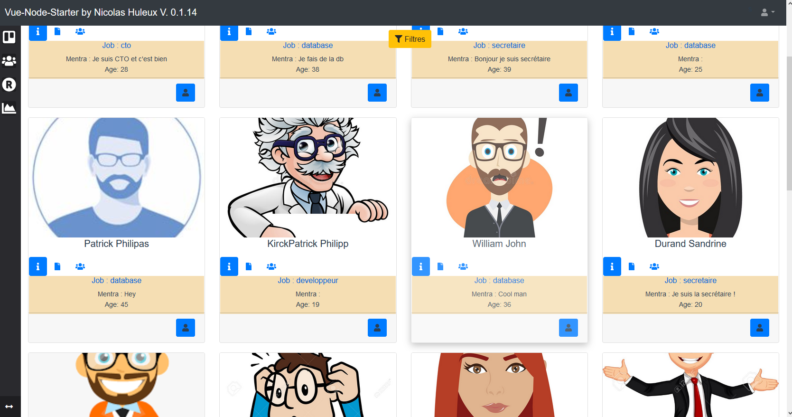

# My Vue.js + Node.js + MongoDb Atlas Full stack starter ! 
-   Blazin' fast 2020 Modern Vue.js + Node.js app starter .<br>
-   Easy to understand CRUD(create,read,update,delete) back end files reminding about the Php or Java style.<br>
-   Pictures are stored on Cloudinary, Files are FTP stored .<br>
-   MongoDb node.js module + Mongoose schemas types modeler, CRUDS files are eventually switchables to SQL relational databases CRUDS with ease<br>
-   Working Mocha Chai unit components testing for Vue.js .<br>
-   This starter is suitable for JS data science, linear regressions, neural networks, Kmeans.. . <br>
-   Git Commits are automatically Heroku synced .<br>

## Demos
<b>HEROKU LIVE DEMO </b>->  : https://vuestartergit.herokuapp.com/  

<a href="https://heroku.com/deploy">
  
</a>



## Desc
This 2020 starter aims is to be able to start any web-app, with all ready generics components, the starter is plugged to a node.js + mongoDb Atlas back end . <br><br>


## LATEST STARTER NEWS ! 
  <br>
  19-10-2020 : Currently converting all node cruds to a reusable generic node CRUD <b>generic_crud.js<b/>: 10 * fasters dev comin soon ... All mongoose schemas will be centralized in models.js !<br>
  19-10-2020 : Another Generic CRUD doc : https://medium.com/@bvodola/crud-routes-generator-with-node-express-js-mongoose-30a16538e16a<br>
  18-10-2020 : The users Filters "memory" must be stored in the centralized VUEX store, App logs have to be centralized in the middleware.js file<br>
  10-10-2020: A Nice generic backend Controller there : https://github.com/DavideViolante/Angular-Full-Stack/blob/master/server/controllers/base.ts<br>
  10-10-2020 : Ftp files are now downloadable from public  users profiles - Coming soon : Social networking on each publics profiles,  infinite scrolls, mooving duplicated AXIOS functions to VUEX<br>
  05-10-2020 :Currently installing Mongoose , and refactoring all cruds files.<br>
  05-10-2020 : Very nice article : https://developer.mongodb.com/article/mongoose-versus-nodejs-driver<br>
  02-10-2020 : Finally, Mongoose is needed, because the datas models aren't well described <br>
  01-10-2020 : Added VueX , When a user logs in, his JSON object is now stored in the VUEX store (main.js).<br>
  09-26-2020 : next dev step is resolving the user front end storing problem(Actually both stored as global $user for navbar displaying and in localstorage, this duplicate is bad), I will probably install Vuex<br>
  09-26-2020 : Trying to get new ideas from this starter : https://github.com/christopherliedtke/vueX_nodeExpress_mongoDB_wAuth_starter<br>
  09-26-2020 : Users Filters are now localstorage stored .<br>
  09-26-2020 : an app logStream is now installed.<br>
  09-19-2020 : The app is now blazin' fast ! We can moove forward now !!<br>
  09-19-2020 : The group query was slowing the readUsers web service a lot ! Disabled and making it a background task theses days! ReadUsers is now immediate ! The app will be blazin' fast<br>
  09-10-2020 : The infinity free FTP policy is limiting and blocking at a certain point :  230-Your bandwidth usage is restricted... I am currently searching for another FTP - reading and downloading from FTP is now working<br>
   09-17-2020 : Uploading multiples files to the FTP server is now working, next step is reading files from FTP ...<br>
  08-05-2020 : Uploadings pics is now active on heroku, switching to the tmp directory. next step is activating the ftp files uploading<br>
  08-04-2020 : I'm currently focused on performance issues ( initial loading is too slow)<br>
 08-04-2020 : This app is now automatically synced to heroku, when commiting, its so easy to use !<br>
 08-04-2020 : Pictures are now stored on cloudinary, i'm trying to use the lazy loading module<br>
 08-04-2020 : I'm on  files uploading code refactoring , untill its finished, uploading wont work.<br>

 

<br />

## What's in files ?
-   <b>CONFIG.JSON</b> This is the app configuration , db connexion, ftp connexion, choosing dev or prod, etc ...<br>
-   <b>SERVER.js</b> This is the node.js server: Includes the node.js params, node session module loading and the MIDDLEWARE and CRUDS web services loading. <br>
-   <b>\SRC</b> : This is where you develop the front end vue.js application, this is basically the complete VUE.JS FRONT END application. <br>
-   <b>\DIST</b> : This is where the built appears when you type NPM RUN BUILD, This is the final front end vue.js app ready for production.<br>
-   <b>\CRUDS</b> : Each file is a CRUD WEBS SERVICES( create , read, update , delete).<br>
-   <b>\APPSYSTEM</b> : There, you can find the MongoDb ATLAS Authentication web service (auth.js), and the middleware functions used for webs services middleware control (middleware.js)<br>
-   <b>\TMP</b> : This is a mandatory directory , used for Heroku files uploads.  <br><br>
-   <b>\SRC\App.vue</b> : There, you can find the global medias queries CSS styles, making the app fully responsive on all medias, this is an important part ! . </b>


## Features:
1 VUEX data store<br />
1 Users CRUD<br />
1 MongoDb atlas Auth system<br />
1 Middleware file dedicated to the web services (middleware.js)<br />
1 Mongoose schema modeler <br />
1 Permissions store <br />
1 FTP Files management including rights control<br />
1 Dashboard with some graphicals libs<br />
1 Form validator : (https://vuelidate.js.org/#getting-started)<br />
1 Internal Messaging system<br />
1 Calendar lib<br />
1 V-dialog lib<br />
1 Notifier https://github.com/euvl/vue-notification<br />
1 multi selector : https://vue-multiselect.js.org/ <br />
1 vue-range-slider : https://github.com/xwpongithub/vue-range-slider<br />
1 logStream file for connexions logs, actions logs, etc ...<br />


<br /><br />
## Comin' soon ! ...
1 NEW ! Social network on each user public profiles, allowing all users to share stories, pics etc ...<br />
1 Translation module including English, French , hindi and Chinese.<br />
1 SOCKET.IO realtime evolutive system, allowing several cams at the same time eventually <br />
1 Gps positionning lib <br />
1 Drag n drop lib <br />
1 Node worker-thread ready to go system.<br />
1 Node.js Emailing system<br />
1 Anti Flooding by IP System<br />
1 File session store<br />

<br /><br />
Data science  ...<br />
1 Linear solver lib : https://www.npmjs.com/package/javascript-lp-solver and/or https://github.com/jvail/glpk.js<br />
1 Linear multiple regression lib : https://github.com/luccastera/shaman<br />
1 Neural network  : https://github.com/BrainJS/brain.js<br />
1 Probability distribution lib : https://www.npmjs.com/package/probability-distributions<br />
1 Kmeans lib : https://www.npmjs.com/package/node-kmeans<br />
1 Random forest lib : https://github.com/mljs/random-forest<br />
1 AJAX call some to some python matplot scripts - pictures generators from a FLASK server.<br />
<br /><br />
## French : 
Ce starter est directement mis à jour sur HEROKU quand je commite des mises à jour.<br>
Le but de ce starter est de pouvoir commencer n'importe quel application Node.js + Vue.js + MongoDb Atlas , avec tous les modèles de données génériques déjà prêts (utilisateurs, messages, middleware, gestion de fichiers, temps réel avec socket.io, calendriers ...), ainsi que des libs de data science déjà prêtes à être utilisées pour réaliser des régressions mathématiques, un petit réseau de neurone,  et des graphiques . <br> Si vous clonez ce dépot, l'app doit normalement fonctionner instantanément chez vous ... Il peut vous donner des idées, bien sur, il existe peut être de meilleures architectures, par exemple avec Mongoose qui permet de mieux décrire le modèle de données et ses types, dans l'app.<br /><br>
-   <b>CONFIG.JSON</b> On trouve la configuration de l'app dans ce fichier : Connexion à la db, au ftp, à cloudinary ...<br>
-   <b>SERVER.js</b> Il s'agit du serveur node.js: Inclut les paramètres node.js, le chargement du module de gestion des sessions utilisateur et le chargement des services Web CRUDS.<br>
-   <b>\ SRC:</b> C'est ici que vous développez l'application front-end vue.js, c'est fondamentalement l'application VUE.JS FRONT END complète.<br>
-   <b>\ DIST:</b> C'est là que le build apparaît lorsque vous tapez NPM RUN BUILD, c'est l'application compressée et optimisée pour la production par webpack.<br>
-   <b>\ CRUDS:</b> Chaque fichier est un CRUD WEBS SERVICES (créer, lire, mettre à jour, supprimer) un peu comme en java ou en php, sauf que c'est du NODE.JS.<br>
-   <b>\ APPSYSTEM:</b> Vous y trouverez le service Web d'authentification sur MongoDb Atlas (auth.js) et les fonctions middleware utilisées pour le contrôle des autorisations des services Web (middleware.js)<br>
-   <b>\ TMP:</b> C'est un répertoire obligatoire pour les téléchargements de fichiers sur Héroku.<br>
-   <b>\SRC\App.vue</b> : Dans ce fichier, vous pouvez trouver les CSS Medias queries de l'app qui permettent de régler les styles css pour que cela passe sur tous les matériels .</br>
-   <b>\TESTS</b> : On execute NPM RUN TEST dans ce rep pour tester tous les components de l'app vue.js

## Project setup
```
npm install
```
Clone the depot using smargit, then install the node modules at the root of the app<br>
Clonez ce dépot avec Smartgit, puis installez les modules nodes , en tapant le code précédent à la racine de l'application.<br>
Create a mongoDbAtlas account, Create a cloudinary account, Create and ftp account, then fill config.json


### Compiles and hot-reloads for development on port 8080

```bash
# Starting the vue.js dev env on port 8080, Axios queries are forwarded to port 80 using vue.config.js
# Open a cmd window on WINDOWS then enter: 
npm run serve 

# Starting the node server on port 80
# Open another CMD window then enter : 
node server.js

```
When you want to develop the vue.js application, run these 2 commands in 2 differents windows CMD, at the root of the app.
<br /> Then, go in your browser to localhost: 8080, and modify the files in the \ SRC directory
<br /> To modify the BACK END, it is rather in the CRUDS directory<br>
<br />Quand vous voulez developper l'application vue.js, executez ces 2 commandes dans 2 fenêtres différentes CMD sous windows, à la racine de l'application.
<br />Ensuite, rendez vous dans votre navigateur à localhost:8080, et modifiez les fichiers dans le répertoire \SRC
<br />Pour modifier le BACK END, c'est plutôt dans le répertoire CRUDS


### Compiles and minifies for production
```
npm run build
```
When you are satisfied with your development, you generate a BUILD of your vue.js app which is compressed and optimized, it then appears in the \ DIST directory.<br>
<br />Quand vous êtes satisfait de votre développement, vous générez un BUILD de votre app vue.js qui est compressé et optimisé, il apparait alors dans le répertoire \DIST.

### Run build on port 80
```
npm run start
```
To test your BUILD on port 80, just type localhost: 80 in your browser! In fact, there is only one node server running all the time!<br>
<br />Pour tester votre BUILD sur le port 80 , tapez juste localhost:80 dans votre navigateur ! En fait, il n'y a qu'un seul serveur node qui tourne en permanence !


### Publishing on HEROKU
It is so simple and automatic, 1. Clone this depot in your github, 2. Simply go to heroku and go to the deploy tab then manually deploy your app. 3. Don't even sync the \dist directory when commiting, Heroku does it for you !<br>
<br />C'est tellement simple et automatique, 1. Clonez ce dépôt dans votre github, 2. Allez simplement sur heroku et allez dans l'onglet de déploiement puis déployez manuellement votre application. 3. Même pas besoin de taper NPM RUN BUILD, Heroku le fait automatiquement pour vous. Pour gérer cela, c'est sous l'onglet DEPLOY, c'est trop pratique, tout se fait tout seul, on peut même paramétrer en SYNC automatique dès qu'on fait un commit, l'app se mets à jour toute seule !.


### Run your unit tests
```
npm run test:unit
```

### Lints and fixes files
```
npm run lint
```

### Customize configuration
See [Configuration Reference](https://cli.vuejs.org/config/).


## Let's have a look at a Mongoose User Schema, for a better understanding:

```
const UserSchema = new Schema({
    _id: ObjectId,
    prenom: { type: String, required: true },
    nom: { type: String, required: true },
    email: { type: String, required: true },
    password: { type: String, required: true },
    role: String,
    permissions: Array,
    filenames: Array,
    groups: Array,
    last_update: String,
    img: String,
    birthday: String,
    age: String,
    job: String,
    mentra: String
});
```

<a href="https://www.openode.io/">Sponsored and hosted by opeNode.io</a>
